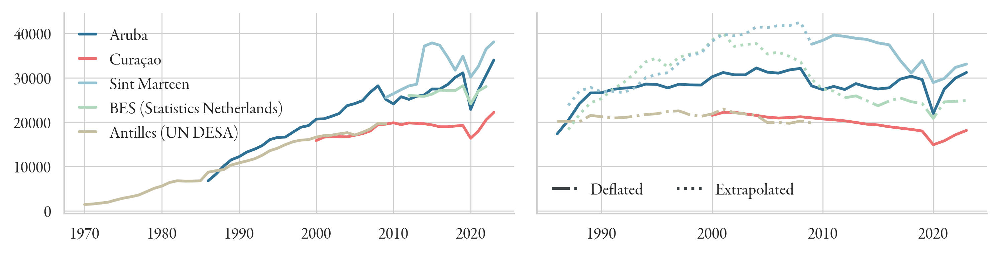
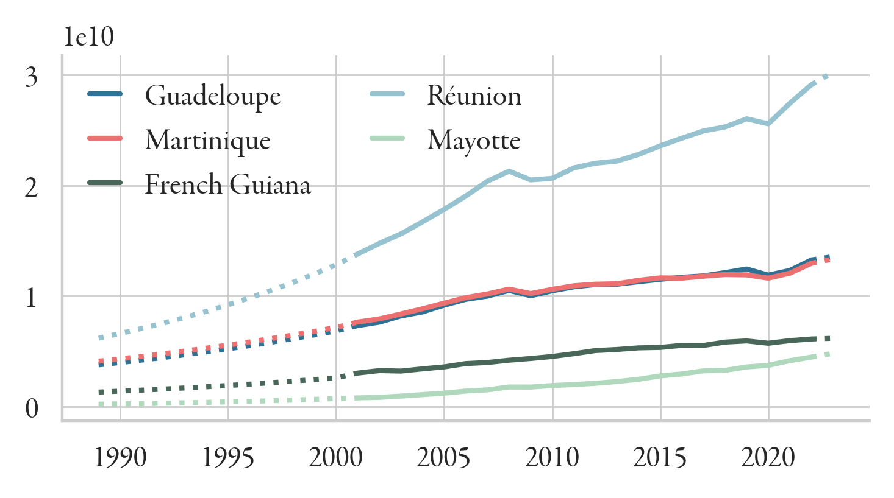
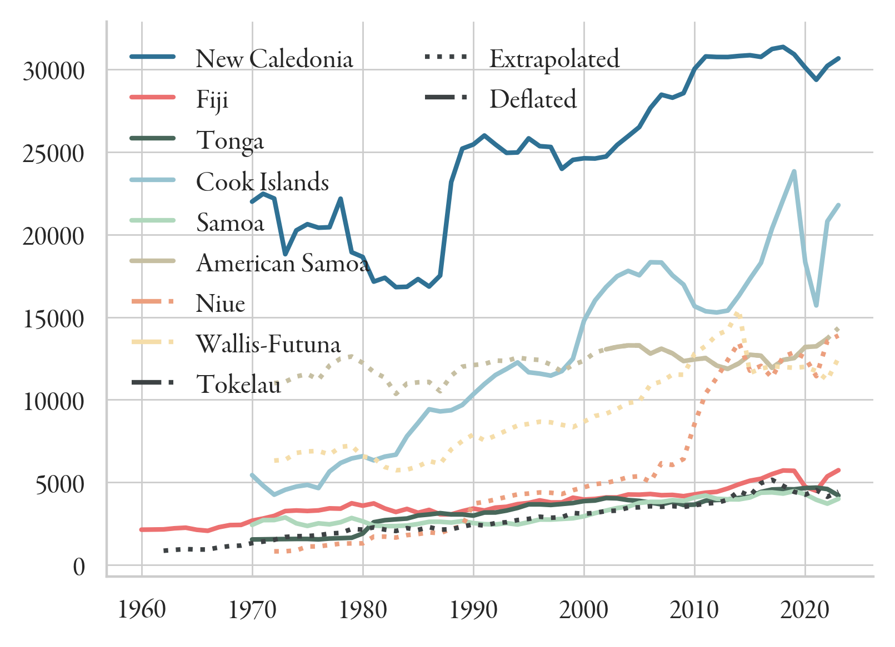
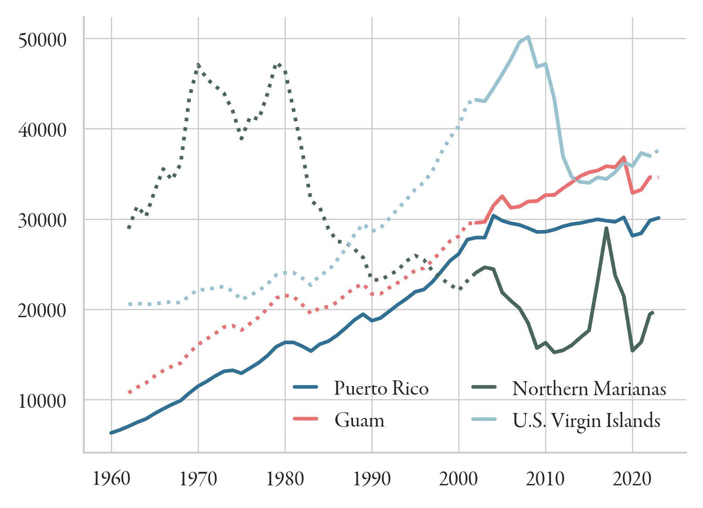
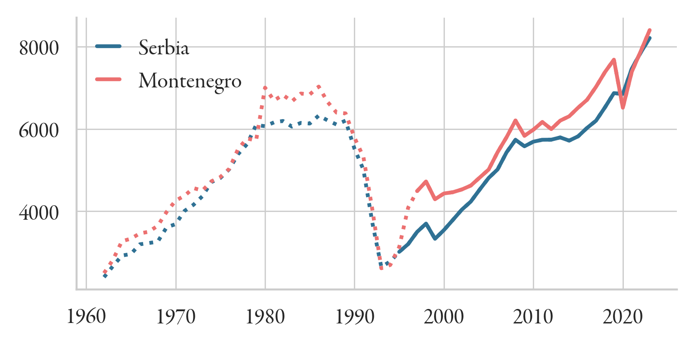
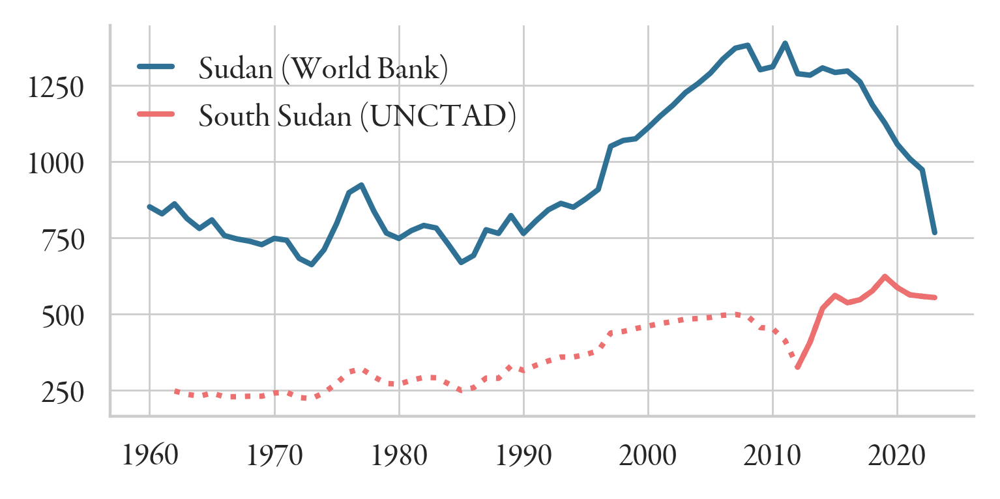
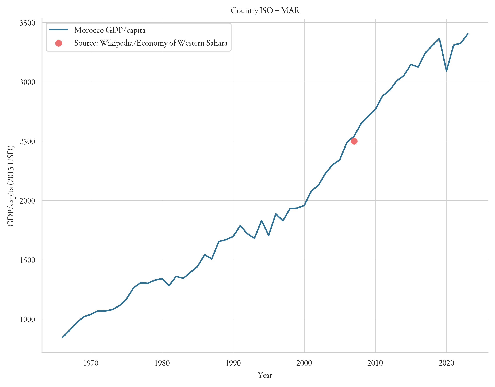
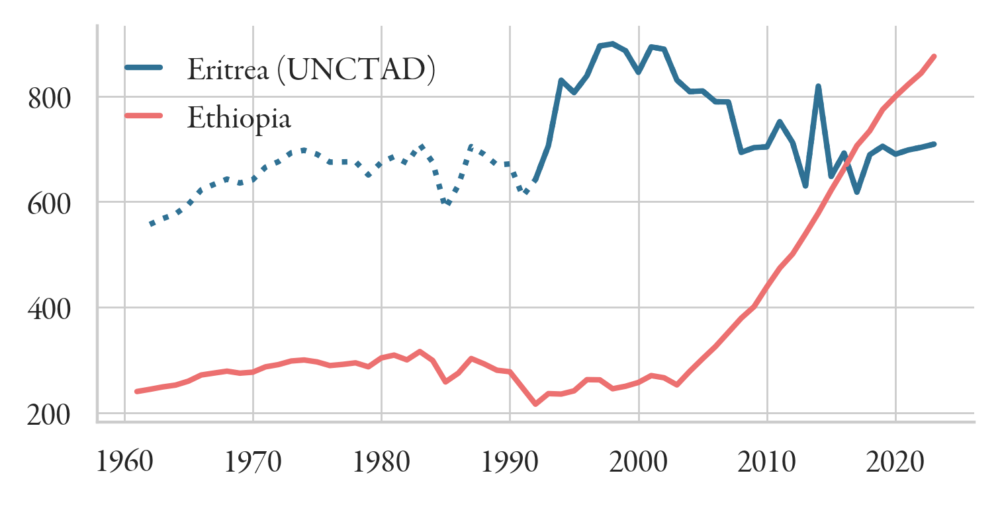
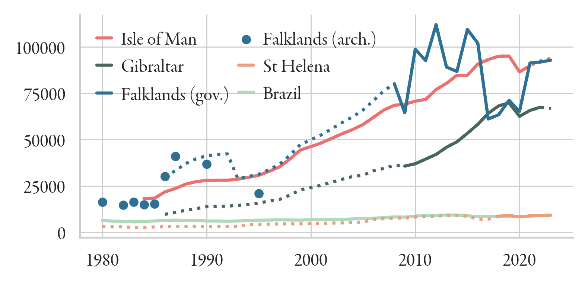
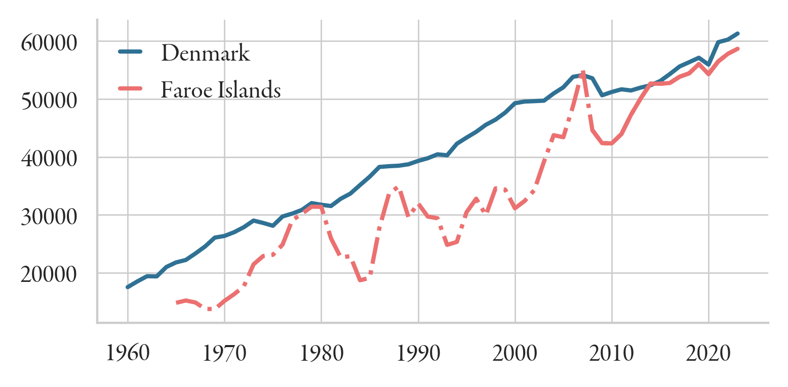

GDP data for 231 nations and territories
---
This folder contains economic data for 231 nations and territories for the period 1960–2023. Real GDP per capita and 
real GDP growth rates are complete for the period 1990–2023, and extend even further back in many cases. The dataset
contains the following variables:

- Nominal GDP
- Real GDP, in 2015 USD
- Nominal GDP/capita
- Real GDP/capita, in 2015 USD
- GDP real annual growth (in %)
- GDP deflator
- Exchange rate

# Main sources
Data is mostly taken from four sources:

- The [World Bank](https://data.worldbank.org)
- [UNCTAD](https://unctadstat.unctad.org/datacentre/dataviewer/US.GDPTotal)
- The [IMF World Economic Outlook Database](https://www.imf.org/en/Publications/WEO/weo-database/2024/October)
- The [Maddison Project](https://www.rug.nl/ggdc/historicaldevelopment/maddison/releases/maddison-project-database-2023)

Since we need complete data on real GDP/capita and real growth rates for the years 1990–2023, we fill gaps by 
extrapolating available data back using the real growth rate, where available. Where this is impossible, we use national 
statistics and estimates from reliable sources to infer gaps; where no data is available at all, we extrapolate using 
neighbouring or similar countries.

### World Bank
The World Bank provides data on nominal and real GDP and GDP per capita, as well as
growth rates, the GDP deflator, and the exchange rate.

### IMF
The IMF provides GDP/capita in current USD, current PPP, and 2021 PPP, as well as GDP at current prices
and GDP % change in their World Economic Outlook dataset.

### Maddison Project
The Maddison Project provides [historical GDP per capita data](https://www.rug.nl/ggdc/historicaldevelopment/maddison/releases/maddison-project-database-2023.)
in const. international 2011 USD.

### UNCTAD
UNCTAD provides real GDP per capita in 2015 USD.

### UN DESA
UN DESA provides some nominal GDP per capita figures [here](https://data.un.org/Data.aspx?d=SNAAMA&f=grID:101;currID:USD;pcFlag:1&c=2,3,5,6&s=_crEngNameOrderBy:asc,yr:desc&v=1)

# Additional Sources
The above datasets allow us to calculate real growth rates for many missing countries and 
territories, and extrapolate values backwards or forwards to estimate GDP/capita. However, many territories
still lack individual values, which we estimate from national statistics (where available), or infer by 
extrapolating back based on data (e.g. deflators) from neighbouring countries.

## Caribbean Netherlands

UN DESA supplies data for the Former Antilles in nominal terms from 1970–2009. These broadly correspond with the WB 
figures for Curacao, the largest of the islands (Aruba became an independent constituent in 1986). 
[Statistics Netherlands](https://www.cbs.nl/en-gb/figures/detail/85251ENG) gives data for the BES 
islands from 2012 on, also in nominal terms. We convert and fill the gaps using the deflator for 
neighbouring Aruba (which uses base year 2013, and is also a constituent part of the Netherlands).

## French overseas territories

Data from [Statista](https://www.statista.com/statistics/1075036/gdp-french-overseas-regions/). 
We extrapolate back to 1989 and forward to 2023 using average growth rates.

## Small Pacific Islands

Source: [Pacific Community](https://sdd.spc.int/dataset/df_national_accounts). This gives nominal GDP from 2025–2023, 
as well as country-specific inflation rates until 2022, which we use as a proxy for the GDP deflator. Additionally, we 
infer missing values using average growth rates from neighbouring countries:
- Niue, Wallis-Futuna, Tokelau: deflated using the inflation rate as a proxy
- American Samoa, Niue, Wallis-Futuna: extrapolated back using the average growth rates of New Caledonia, 
Cook Islands, and Fiji
- Tokelau: extrpolated back using the growth rate of Fiji

## Guam, Northern Marianas, U.S. Virgin Islands.

These are all U.S. overseas territories. 
We extrapolate Guam and the Marianas back from Puerto Rico, and the U.S. Virgin Islands 
using an average of Puerto Rico, Antigua, and St. Kitts and Nevis.

## Serbia and Montenegro

We can extrapolate back using the growth rates given by the Maddison Project.

## South Sudan

The World Bank data for South Sudan is clearly erroneous. 
Since we have stocks from South Sudan from before its founding (2011), 
we can project the GDP of South Sudan back using GDP growth of Sudan 
and adjusting to match the 2009 value.

## East Timor
The growth rate for 1990 is missing; 
[this](https://www.aph.gov.au/~/media/wopapub/senate/committee/fadt_ctte/completed_inquiries/1999_02/east_timor/report/c02_pdf.ashx#:~:text=In%20spite%20of%20the%20economic%20crisis%2C%20the,compared%20to%20the%20national%20figure%20of%206.8%.)
report by the Australian government suggests an average 10% economic growth from 1987-1997, 
due to heavy investment in construction. Given the data we already have, this means GDP 
growth from 1987–1990 must have averaged 11.7%.

## Western Sahara

We use GDP/capita from Morocco, since ESH is under occupation.

## Saint Pierre-Miquelon
We use GDP/capita figures from Canada.

## Eritrea

We extrapolate past 1990 using data from Ethiopia.

## Falklands, Isle of Man, Gibraltar, St Helena

- **Isle of Man**: [Government figures](https://www.gov.im/media/1386794/moodys-isle-of-man-credit-rating-report-december-2024.pdf) 
estimate real GDP growth at 2.9% in 2022, and 1.5% in 2023.
- **Falklands**: Some data is available from the [Falklands government](https://www.falklands.gov.fk/policy/statistics/national-accounts) 
and [historical archives](https://www.nationalarchives.gov.fk/jdownloads/Trade%20and%20Industry/R-TRA-ECO-2-2.%20Economy%20of%20the%20Falkland%20Islands.pdf). 
These datapoints match the population-scaled GDP of the Isle of Man very well, so we will the gaps using data from the Isle of Man.
- **Gibraltar** [Government figures](https://www.gibraltar.gov.gi/uploads/statistics/2024/National%20Income/2024.01.02%20Revised%202024.07.01%20National%20Income%20for%20Website%20BB24.png) 
give GDP in nominal terms. We use the deflator for GBR. Missing values (pre-2009) are extrapolated back using Isle of Man data.
- **St Helena**: Nominal St Helena data is available from the [government website](https://www.sainthelena.gov.sh/st-helena/statistics/st-helena-in-figures/economy/#gdp). 
We extrapolate back using data from Brazil.

## Faroe Islands

We use the Danish deflator to extrapolate back.

