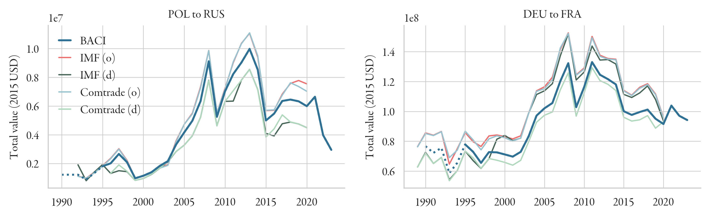
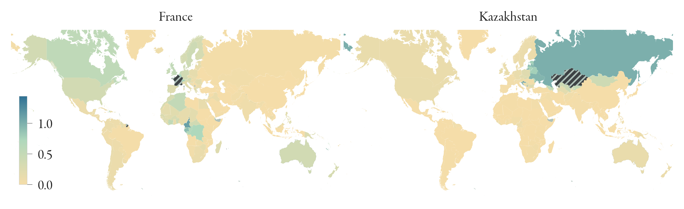
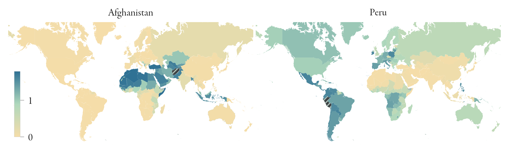

Gravity covariates
---
This folder contains unilateral and bilateral covariates used to train the model.
GDP data, which is stored in the `Data/GDP_data` folder. Demographic data, such as total population, and
birth and death rates, is given in the `Data/UN_WPP_data` folder. Conflict data is stored in the
`Data/UNCDP_data` folder, and refugee data is given in `Data/UNHCR_data`.

## Bilateral trade (`trade_flows`)
Total trade flow between origin and destination is taken from the [CEPII BACI dataset](https://www.cepii.fr/CEPII/en/bdd_modele/bdd_modele_item.asp?id=37), 
which contains data from 1995–2023. We deflate to const. 2015 USD using the World Bank GDP deflator (provided in the 
`GDP_data` folder) and fill missing values using the growth rates from UN Comtrade and IMF data, which are also provided 
by CEPII. Remaining NaN values are backwards-filled using the last known value. Only the `Value (2015 USD)` variable is 
complete for the period from 1990, since this is the only covariate we are using as a training input.

## Linguistic similarity (`lang`)
Linguistic similarity is taken from the USITC [Domestic and International Common Language Database (DICL)](https://www.usitc.gov/data/gravity/dicl.htm) 
language database. We use the ``csl`` (common spoken language index). 
As detailed in the description, data for 46 countries is missing: ``AFG, ALA, ANT, ARE, BHR, BIH, BLM, BMU, CCK, CXR, CYM, ERI, FLK, FRO, GGY, GRD, GRL, IOT, ISL, JEY, KNA, KWT, LBY, LIE, MAF, MDV, MSR, NFK, OMN, PCN, PRK, PSE, SDN, SHN, SMR, SOM,
SPM, SXM, SYR, TCA, TJK, TKL, VAT, VCT, VGB, VNM`` 
In these cases, we use the average of linguistic proximity (``lpn``) and common native language (``cnl``) instead, as 
recommended by the authors. For the remaining missing datapoint (BES islands), we use Curacao as a proxy.

## Religious similarity (`relig`)
This is calculated from the ['Correlates of War'](https://correlatesofwar.org/data-sets/world-religion-data/) database, 
which gives the shares of religious adherence for each country. 
Missing values are taken from the [CIA World Factbook](https://www.cia.gov/the-world-factbook/). 
The religious similarity between two countries is then simply $\langle \alpha_i, \alpha_j \rangle$, 
where $\alpha_i$ is the religious makeup of country $i$. The 'other' category is excluded (``othrgenpct``).

## EU membership (`eu`)
Information on EU membership is taken from the CEPII dataset. 
Since EU membership structure has not changed since 2021 (Brexit), we can extrapolate those values forward.
EU membership is marked with a '1', non-membership is marked with a 0.

## Colonial ties (`col`)
Colonial ties are taken from the USITC DGD gravity database (``colony_of_destination_ever``).

## Geographic distance (`dist.nc`)
Distance is taken from the CEPII dataset (``distw_harmonic``). 
This is the population-weighted distance between countries. 
Though the covariates in CEPII is time-dependent, we take the time-averaged value to facilitate predictions on 
new (future/past) data. Missing datapoints are the British Virgin Islands (VGB) and the Isle of Man (IMN). For the former, 
we use the data for the U.S. Virgin Islands and set the distance (VGB-VIR) to 80 km. For the latter, we use the UK data and
set the distance (IMN-GBR) to 300 km.

