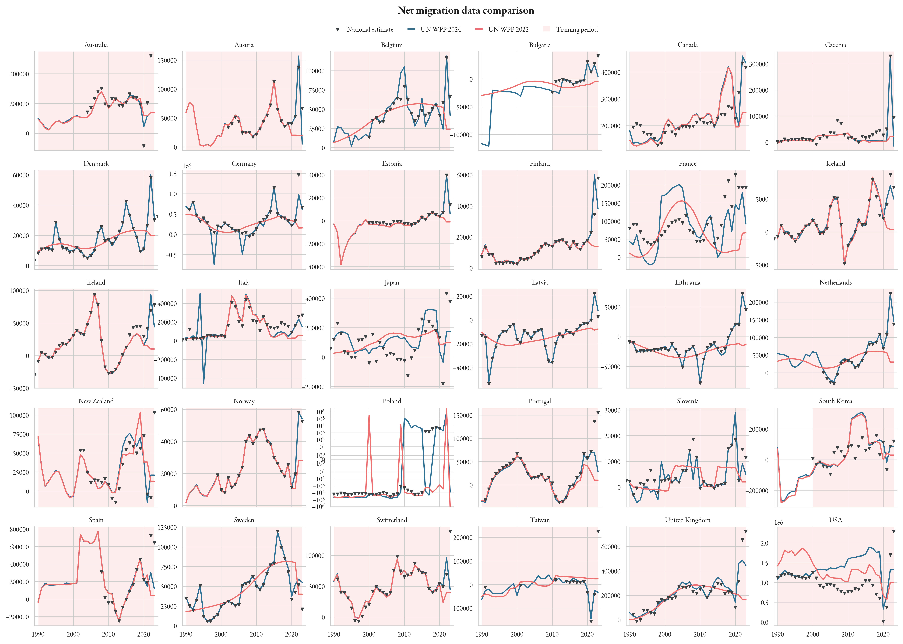

 Net migration data from national statistical offices
---
This folder contains net migration figures from around 30 countries from 1990 to 2023. The data is provided both in `.csv`
and `.nc` (netcdf) format, indexed by `Year` and `Country ISO` (the ISO3 code of country, following the UN norm). 
For some countries, we include the UN WPP figures for missing years -- this is specified below:
All UN WPP figures relate to the 2024 report. All figures are given in units of 1.

**Sources**
- Australia: [Australian Bureau of Statistics](https://www.abs.gov.au/statistics/people/population/overseas-migration/latest-release#data-downloads). WPP data is included.
Austria: [Statistik Austria](http://statcube.at/statcube/opendatabase?id=debevwan010). WPP data is included.
- Belgium: [StatBEL](https://statbel.fgov.be/en/themes/population/population-movement/migration). WPP 2024 data is included. 
- Bulgaria: [National Statistics Institute of Bulgaria](https://www.nsi.bg/en/content/3072/international-migration-age-and-sex), data given from 2010. 
- Canada: [Statistics Canada](https://www150.statcan.gc.ca/t1/tbl1/en/tv.action?pid=1710000801). 
  These figures are mid-year to mid-year, so we take midpoint averages. WPP data is included.
- Czech Republic: [Czech Statistical Database](https://vdb.czso.cz/vdbvo2/faces/en/index.jsf?page=vystup-objekt&z=T&f=TABULKA&skupId=4791&katalog=33157&pvo=DEMDCR1&pvo=DEMDCR1#w=).
- Denmark: [Statistics Denmark](https://www.dst.dk/en/Statistik/emner/borgere/flytninger/ind-og-udvandring)
- Germany: [Statistisches Bundesamt](https://www.destatis.de/DE/Themen/Gesellschaft-Umwelt/Bevoelkerung/Wanderungen/Tabellen/wanderungen-zwischen-deutschland-und-dem-ausland-jahr-02.html). WPP data is included.
- Estonia: [Statistics Estonia](https://andmed.stat.ee/en/stat/rahvastik__rahvastikusundmused__ranne/RVR03). WPP 2024 data is included.
- Finland: [Statistics Finland](https://pxdata.stat.fi/PxWeb/pxweb/en/StatFin/StatFin__muutl/statfin_muutl_pxt_11ab.px/).
- France: [INSEE](https://www.insee.fr/fr/statistiques/2381468)
- Iceland: [Statistics Iceland](https://px.hagstofa.is/pxen/pxweb/en/Ibuar/Ibuar__buferlaflutningar__buferlaflmillilanda/MAN01400.px/)
- Ireland: [CSO Ireland](https://data.cso.ie), PEA03 - Estimated Migration (Persons in April). 
  Data is given April-April needs to be shifted back by 4 months. Figures from 2017 onwards do not agree with UN WPP 
  estimates due to a revision of the Irish census.
- Italy: Istat [historical](https://seriestoriche.istat.it/index.php?id=1&no_cache=1&L=1&tx_usercento_centofe%5Bcategoria%5D=32&tx_usercento_centofe%5Baction%5D=show&tx_usercento_centofe%5Bcontroller%5D=Categoria&cHash=04e5a2e51acfa92f173aac082f0d8872) and [current](https://www.istat.it/it/files/2024/05/Migrazioni-interne-e-internazionali-della-popolazione-residente.pdf) datasets.
- Japan: Data is provided by the Japanese [Immigration Services Agency](https://www.moj.go.jp/isa/policies/statistics/toukei_ichiran_nyukan.html?hl=en)
- Latvia: [Official statistics of Lativa](https://data.stat.gov.lv/pxweb/en/OSP_PUB/START__POP__IB__IBE/IBE010/)
- Lithuania: [Statistics Lithuania](https://osp.stat.gov.lt/statistiniu-rodikliu-analize?indicator=S3R363#/)
- Netherlands: [Statistics Netherlands](https://www.cbs.nl/nl-nl/dossier/dossier-asiel-migratie-en-integratie/hoeveel-immigranten-komen-naar-nederland). WPP 2024 data is included.
- New Zealand: [StatNZ](https://www.stats.govt.nz/information-releases/international-migration-september-2024/#annual). WPP data is included.
- Norway: [Statistics Norway](https://www.ssb.no/en/statbank/table/05426/). Pre-1999 we use UN WPP data.
- Poland*: [Statistics Poland](https://stat.gov.pl/en/topics/population/internationa-migration/main-directions-of-emigration-and-immigration-in-the-years-1966-2020-migration-for-permanent-residence,2,2.html). WPP data is included. 
  This data is currently not included in to train the model, since it is based on registrations and thus presumably
  significantly underestimates the real flows.
- Portugal: Data from Statistics Portgual ([from 2002](https://www.ine.pt/xportal/xmain?xpid=INE&xpgid=ine_indicadores&indOcorrCod=0006200&contexto=bd&selTab=tab2) and [from 2013](https://www.ine.pt/xportal/xmain?xpid=INE&xpgid=ine_indicadores&indOcorrCod=0008269&contexto=bd&selTab=tab2))
- Slovenia: [Statistical Office Slovenia](https://pxweb.stat.si/SiStatData/pxweb/en/Data/Data/05N1002S.px/)
- South Korea: [Statistics Korea](https://kostat.go.kr/board.es?mid=a20108050000&bid=11745) International Migration Statistics. WPP data is not included.
- Spain: [INE](https://www.ine.es/dyngs/INEbase/en/operacion.htm?c=Estadistica_C&cid=1254736177000&menu=ultiDatos&idp=1254735573002). WPP data is included.
- Sweden: [Statistics Sweden](https://www.statistikdatabasen.scb.se/pxweb/en/ssd/START__BE__BE0101__BE0101J/ImmiEmiFlyttN/)
- Switzerland: Source: [Bundesamt für Statistik](https://www.bfs.admin.ch/bfs/de/home/statistiken/bevoelkerung/migration-integration/internationale-wanderung.assetdetail.32229097.html). WPP data is included.
- Taiwan: [Statistics Taiwan](https://eng.stat.gov.tw/News_Content.aspx?n=4302&s=232173). WPP data is included.
- United Kingdom: [ONS](https://www.ons.gov.uk/peoplepopulationandcommunity/populationandmigration/internationalmigration/datasets/longterminternationalimmigrationemigrationandnetmigrationflowsprovisional). WPP data is included.
- United States: We combine various estimates:
  - https://www.census.gov/library/stories/2022/12/net-international-migration-returns-to-pre-pandemic-levels.html
  - https://www.cbo.gov/publication/59683
  - https://www.census.gov/newsroom/blogs/random-samplings/2024/12/international-migration-population-estimates.html
  - https://www.brookings.edu/articles/immigration-is-driving-the-nations-modest-post-pandemic-population-growth-new-census-data-shows/
  - https://www.census.gov/data-tools/demo/idb/#/dashboard?dashboard_page=country&COUNTRY_YR_ANIM=2025

