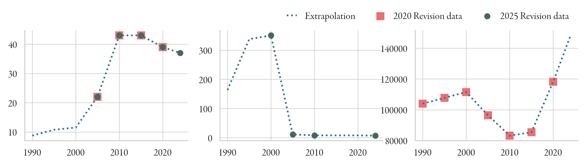
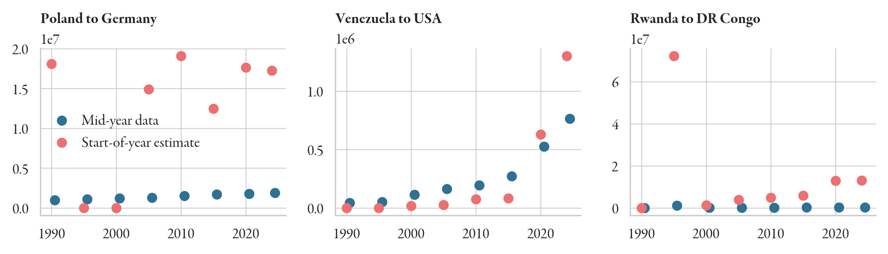
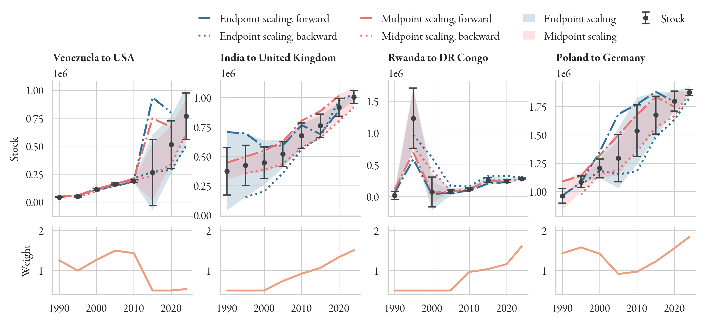
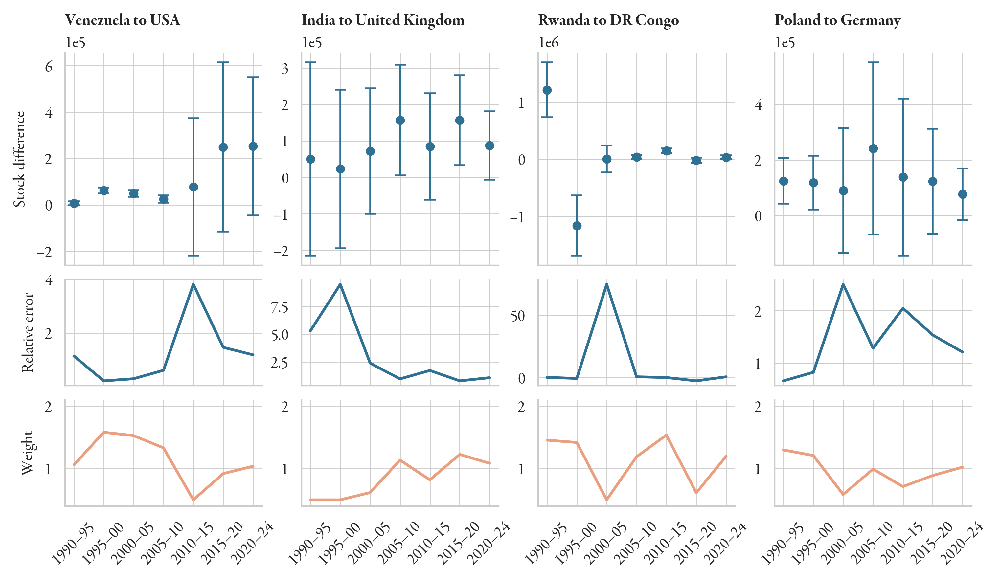
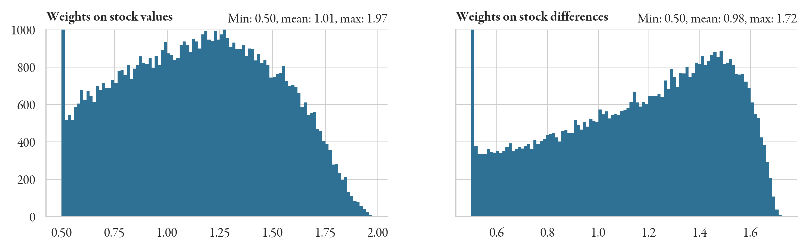

UN DESA stock data and associated estimates
---
The `stock_data.nc` file contains the various UN stock data estimates. 
Stock data is provided by the [UN DESA](https://www.un.org/development/desa/pd/content/international-migrant-stock), 
and give the foreign-born stocks at midyear. We have two revisions of the stock data, one from 2020, one from 2024. 
We use the 2024 values where available, and fill NaNs with the 2020 value. 
Some obvious mistakes are manually corrected. We interpolate missing values using neighbourhood correlation, 
and then scale the estimates at mid-year to give a value at the start of each year.

The data contains the following data variables:

- `2020 Revision`: original data from the 2020 Revision, mid-year estimates
- `2025 Revision`: original data from the 2025 Revision, mid-year estimates
- `Combined`: Union of the two, with mistakes corrected
- `Mask`: Mask for `NaN` values
- `Interpolated`: interpolated stock values
- `Start of year estimate`: start of year estimates, latest version
- `Error`: errors on stock data
- `Weight`: weights on the stocks

Details on each are given below:

## `2020 Revision`/`2025 Revision`
These are all the original estimates.

## `Combined`
The union of the 2025 and 2020 estimates, with the following mistakes corrected:
```python
# Canada
stock_data["Combined"].loc[{"Origin ISO": "SYC", "Destination ISO": "CAN", "Year": [1990, 1995]}] = [2248., 1160.]
stock_data["Combined"].loc[{"Origin ISO": "CUW", "Destination ISO": "CAN", "Year": 2010}] = 399
stock_data["Combined"].loc[{"Origin ISO": "BES", "Destination ISO": "CAN", "Year": [2010, 2015, 2020]}] = [40.0, 40.0, 44.0]
stock_data["Combined"].loc[{"Origin ISO": "SXM", "Destination ISO": "CAN", "Year": 2010}] = 105.0

# Germany in US
stock_data['Combined'].loc[{"Origin ISO": "DEU", "Destination ISO": "USA", "Year": 1995}] = 1335539
# France
stock_data["Combined"].loc[{"Origin ISO": "AIA", "Destination ISO": "FRA", "Year": 2005}] = 12

# Vietnamese in Malaysia
stock_data["Combined"].loc[{"Origin ISO": "VNM", "Destination ISO": "MYS", "Year": range(1990, 2023, 5)}] = stock_data["2020 Revision"].sel({"Origin ISO": "VNM", "Destination ISO": "MYS", "Year": range(1990, 2023, 5)}).copy()
stock_data["Combined"].loc[{"Origin ISO": "VNM", "Destination ISO": "MYS", "Year": 2024}] = 1.09e+5

# Turkmenistan in Greece
stock_data["Combined"].loc[{"Origin ISO": "TKM", "Destination ISO": "GRC", "Year": [1990, 1995]}] = [96., 82.]

# Bangladeshis in Egypt
stock_data["Combined"].loc[{"Origin ISO": "BGD", "Destination ISO": "EGY", "Year": [2010, 2015, 2020, 2024]}] = [557.,  1015., 1173.,  762.]

# Russians in Serbia
stock_data["Combined"].loc[{"Origin ISO": "RUS", "Destination ISO": "SRB", "Year": 1995}] = 810

# Russians in Egypt
stock_data["Combined"].loc[{"Origin ISO": "RUS", "Destination ISO": "EGY", "Year": 2015}] = 23462

# Ukrainians in Egypt: mask 2015 value
stock_data["Combined"].loc[{"Origin ISO": "UKR", "Destination ISO": "EGY", "Year": 2015}] = 2349

# Lebanese in Egypt
stock_data["Combined"].loc[{"Origin ISO": "LBN", "Destination ISO": "EGY", "Year": 2015}] = 2045

# North Macedonia in Hungary
stock_data["Combined"].loc[{"Origin ISO": "MKD", "Destination ISO": "HUN", "Year": [1990, 1995]}] = [460, 230]

# Comoros in South Africa
stock_data["Combined"].loc[{"Origin ISO": "COM", "Destination ISO": "ZAF", "Year": 2005}] = 71

# Aruba in France
stock_data["Combined"].loc[{"Origin ISO": "ABW", "Destination ISO": "FRA", "Year": 2005}] = 7
```
We also require the stocks to be at least as large as the UNHCR refugee data.

## `Mask`
We calcualte a mask of missing (NaN) values. The mask excludes these points from the loss function 
used to train the neural network.

## `Interpolated`
We extrapolate and interpolate missing values to obtain initial values for stocks, where missing.
This is necessary because the migrant stocks are a training covariate, and though they are recursively
estimated through the neural network, the initial value (at 1990) is needed to start the process.
The interpolation is performed using a weighted average growth rate: 
let $S_{ij}(t)$ be a stock time series with missing data. We then consider the correlation 
$$C_{jk} = \mathrm{corr}(S_{ij}, S_{ik})$$ and the distance coefficient 
$$\rho_{jk} = \exp(-d_{jk})$$ and calculate the weighted growth rate using the weight 
$$w_{jk} = C_{jk} \times \rho_{jk} / \sum_k \rho_{jk}.$$ Then, given a matrix of stock growth values, 
$$g_{ij}(t) = S_{ij}(t) / S_{ij}(t-1) - 1,$$ the average growth rate is simply 
$$\bar{g}_{ij}(t) = \dfrac{\sum_k g_{ik} w_{jk}}{\sum_k w_{jk}}.$$



The diagonal is filled with estimates of the native-born population, given by $$S_{ii} = P_i - \sum_{j \neq i} S_{ji}.$$


## `Start of year estimate`
Since DESA provides mid-year estimates, we need to scale our estimates to the start of the year. We do this using iterative
proportional fitting (IPF). We do so by subtracting half the total births from that year, and then dividing by the half-annual 
death rate $1-\gamma_{1/2} = \sqrt{1-\gamma}$.



## `Error` and `Weights`
Weights on the stock targets are calculated by scaling successive stock matrices to the midpoints of their marginals, 
after accounting for demographic change (births and deaths). 
We can scale two matrices to their midpoints or their endpoints. 
This gives between 2 and 4 new estimates for each value $S_{ij}(t)$, from which we can calculate a weight.

The weights and errors are based on the start-of-year estimates.
Weights are given by the negative exponential of the normalised relative error $$\dfrac{\langle \hat{S}_k - S \rangle_k}{S},$$ 
where $k$ indexes the different stock matrix estimates we obtain from IPF. 

The weight is clipped to $[0.5, 2]$.



## Stock differences
We are actually training the neural network to match stock *differences*, not absolute values.
We actually want to learn the stock differences, not the absolute values. 
As before, we then set the weights on the differences to the negative exponential of the normalised relative error 
$$\dfrac{\sqrt{\sigma_1^2 + \sigma_2^2}}{\max(\vert \Delta S\vert, 1)}.$$




