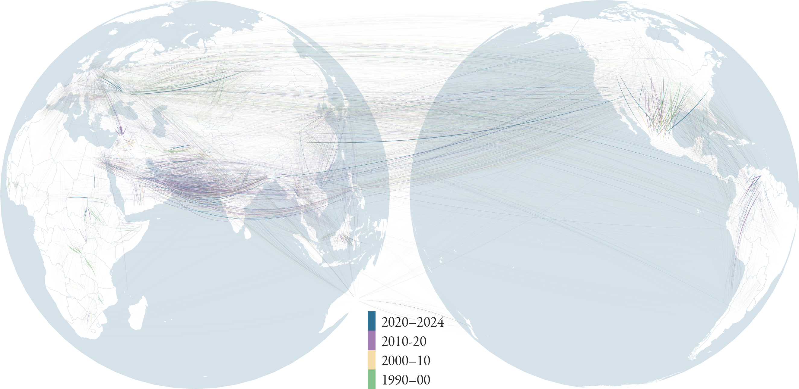

Deep learning-based estimates of global migration flows
---
[](https://www.python.org/downloads/release/python-380/)
[](https://www.python.org/downloads/release/python-390/)
[](https://www.python.org/downloads/release/python-3100/)
[](https://www.python.org/downloads/release/python-3110/)

This repository contains all code and data needed to train and evaluate a deep neural network 
used to infer annual bilateral migration flows between all countries since 1990. Once you have downloaded the datasets 
from [huggingface](https://huggingface.co/datasets/ThGaskin/Migration_flows), you can use the `Evaluate.ipynb` notebook 
to evaluate the data. The `Evaluate.ipynb` notebook will guide you through the evaluation 
process step-by-step (see below) and allow you to recreate all the plots from the [publication](https://arxiv.org/abs/2506.22821).

> [!NOTE]
> This repository is work in progress and is still being updated. `git fetch & git pull` regularly for updates. If you encounter any problems, please [file an issue](https://github.com/ThGaskin/Migration_flows/issues/new).

## Obtaining the data
The first step is to obtain the data, which is hosted at [Huggingface](https://huggingface.co/datasets/ThGaskin/Migration_flows/tree/main), including the 
input covariates, migration flow estimates, and trained neural networks. To pull this data and start evaluating the results, 
follow these steps:

To obtain the data, we recommend using the 
[huggingface CLI](https://huggingface.co/docs/huggingface_hub/en/guides/cli) to download all the data:
```commandline
curl -LsSf https://hf.co/cli/install.sh | bash
```
Then, login using your access token:
```commandline
hf auth login
```
Finally, download the data into this folder:
```commandline
hf download ThGaskin/Migration_flows --repo-type=dataset --local-dir . --exclude "README.md"
```
Excluding the README.md is necessary to prevent the huggingface README overwriting this one. Don't worry: all
the information from the huggingface dataset card is also provided here.

> [!WARNING]
> The full flow table `T.nc` is quite large — around 3GB! Make sure you have enough system memory to load it. 
> If you are only interested in bilateral total flows (without the disaggregation by country of birth), the `flows.nc` file 
> is considerably smaller and easier to handle.


## Estimates
If you only want to open and analyse the data, the `Estimates` folder contains:
- A file `flows.nc`: total origin-destination flows
- A file `stocks.nc`: migrant stocks, including native-born stocks on the diagonal
- A file `net_migration.nc`: net migration estimates
- A file `T.nc` containing all flows, disaggregated by birth, is provided in the Zenodo repository.

Additionally, we provide two files for user convenience:
- `mig_unilateral.csv`, containing the following unilateral variables:
  - `imm`: total immigration flows
  - `emi`: total emigration flows
  - `net`: net migration
  - `imm_pop`: total immigrant population (i.e. not native-born)
  - `emi_pop`: total emigrant population (i.e. living abroad)
- `mig_bilateral.ncsv`, provided in the Zenodo repository, containing the following variables:
  - `mig_prev`: total origin-destination flows
  - `mig_brth`: bilateral flows by birth, i.e. the `Origin ISO` coordinate reflects the birth place
All files give both a mean estimate and a standard deviation.

## Installation and Evaluation
The `Evaluate.ipynb` Jupyter notebook contained in this folder will guide you through the model evaluation step-by-step. Before you can run
it, you will need to make sure you have installed all the required Python packages. We recommend creating a new virtual
environment and installing packages into it; you can easily install all required packages using the command
```commandline
pip install -r requirements.txt
```
If you are not executing the command from within this folder, adjust the command to point to the `requirements.txt` file
contained in this folder. Make sure you have downloaded the `T.nc` file from the Zenodo repository into the `Estimates` folder.

### Installing GPU-accelerated PyTorch
We use [`PyTorch`](https://pytorch.org) to build and train the model. Given the size of the model, we recommend using 
GPU-accelerated PyTorch for faster evaluation and training — but this is optional. Follow the [correct installation 
guide](https://pytorch.org/get-started/locally/) for your system. In the `Evaluate` notebook, you can then set the default 
device to use:

```python
device = 'cuda' # alternatively: 'cpu' or 'mps'
torch.set_default_device(device)
```
If you are using macOS on Apple Silicon, the GPU device is called `mps`. Note that printing `torch.tensors` from the GPU
to the jupyter console is sometimes not supported; move a tensor to the CPU first by running
```python
print(tensor.cpu())
```
## Training data
All training data (inputs and targets) is provided in the `Data` folder. This folder contains the input data as PyTorch `torch.Tensors` (located in `Data/Training_data`), but we also provide all the original data in seperate subfolders. The `Data/README` file gives a high-level overview of each folder's contents, and each subfolder (where necesssary) contains its own seperate README file detailing the data source and collection methodology.

## Trained neural networks
The trained networks are located in the `Trained_networks` folder. Since we have trained an ensemble of networks, each ensemble member is given in its own folder. These folders contain:
- The model weights (`model_trained.pt`)
- The optimizer state, in case you wish to continue training the model from its current state (`optim.pt`)
- The config file used to run the model (`cfg.yaml`, see below)
- A `pickle` file showing the training loss evolution 

## Train your own model
The neural network weights are stored in the `Trained_networks` folder, alongside the configuration file used to create it.
The training code is fully configuration-based, meaning you do not need to edit any Python code to configure the training procedure.
Instead, you can adjust the settings in the `Code/cfg.yml` file, and then call
```python
python -m Code.train_model
```
This will load all the training data, located in `Data/Training_data`, and train a neural network. We recommend training
on a GPU. You can also use your own configuration file to run the model, passing the path to the config as an argument:
```python
python -m Code.train_model path/to/cfg.yaml
```
Below you will find a guide to all the settings provided in the `Code/cfg.yaml` file; the settings shown are
the original settings used to train the network:

```yaml
# Set this to point to this folder
BASE_PATH: "."

# Training device to use
device: 'cuda'

# Optional note that is added to the output path. Output data is stored in a time-stamped folder
# in `Results/`, alongside the configuration file used to run the model. That way, everything you do is
# stored and fully reproducible
path_note: ~ 

# Set this to True to run a model without saving any output -- useful for debugging so that 
# your Results folder doesn't get cluttered
dry_run: True 

# Settings for loading the training data
Data_loading:

  # Path to data, relative to base path
  data_path: 'Data/Training_data'

  # Passed to `torch.load`.
  load_args: {weights_only: True}

  # If you have trained a model and want to pick up where you left off, point this to the
  # directory from where you wish to load and continue training the model. 
  # Note that this will OVERWRITE the existing model, so proceed with caution.
  load_from_dir: ~

  # Rescaling constant for the target data -- we measure everything in 1000 people to
  # prevent numerical overflow. Results must afterwards then be scaled again by this value.
  data_rescale: 1e3

  # Covariates to use; this is order-specific. The 'idx' key is a list of unilateral or
  # bilateral keys to use; e.g. [i, j, k] creates three covariates, one for each country. 
  # [[i, j], [j, k]] adds two covariates for a bilateral covariate, one for i-j and one for the 
  # j-k edge
  covariates:
    - GDP_cap:
        path: 'input_covariates/GDP_cap' # GDP per capita
        idx: [i, j, k]
    - GDP_growth:
        path: 'input_covariates/GDP_growth' # GDP growth
        idx: [i, j, k]
    - Trade:
        path: 'input_covariates/Trade'
        idx: [[j, k], [k, j]]
    - Population:
        path: 'input_covariates/Population'
        idx: [i, j, k]
    - Life_expectancy:
        path: 'input_covariates/Life_expectancy'
        idx: [i, j, k]
    - Birth_rate:
        path: 'input_covariates/Birth_rate'
        idx: [j, k]
    - Death_rate:
        path: 'input_covariates/Death_rate'
        idx: [j, k]
    - Distance:
        path: 'input_covariates/Distance'
        idx: [[j, k]]
    - Linguistic_similarity:
        path: 'input_covariates/Linguistic_similarity'
        idx: [[i, k], [j, k]]
    - Religious_similarity:
        path: 'input_covariates/Religious_similarity'
        idx: [[i, k], [j, k]]
    - Conflict_deaths:
        path: 'input_covariates/Conflict_deaths'
        idx: [j, k]
    - Refugees:
        path: 'input_covariates/Refugees'
        idx: [[i, j], [i, k]]
    - Colonial_ties:
        path: 'input_covariates/Colonial_ties'
        idx: [[i, k], [j, k]]
    - EU:
        path: 'input_covariates/EU'
        idx: [i, j, k]

# Neural network settings. Adjust these to determine the neural network architecture
# Ensure your system is capable enough to run larger networks --- the settings below are the 
# original training settings.
NeuralNet:
  num_layers: 7
  nodes_per_layer:
    default: 60
  activation_funcs:
    default: tanh
    layer_specific:
      -1:
        name: celu
        args: [-12]
  biases:
    default: [-1, 1]
  learning_rate: 0.002
  optimizer: Adam
  latent_space_dim: 100

# Training settings
Training:

  # Number of epochs
  N_epochs: 100000
  
  # Due to memory constraints, we cannot optimise all 900,000 edges at the same time.
  # This setting draws a random sample of edge indices, which are optimised. A smaller value
  # is more memory efficient but means the model will take longer to converge.
  # Use the maximum size that will fit your GPU -- around 50,000 for a good GPU, depending also
  # on the size of the neural network and latent space dimension.
  Random_sample_size: 100000
  
  # Perform a gradient descent step after every batch. A batch is a single five-year interval, 
  # corresponding to one stock data interval. For the period from 1990--2023, there are seven batches.
  # We recommend using the full training period as a batch (batch gradient descent)
  Batch_size: 7
  
  # Store the neural network after this many steps
  write_every: 100

  # If you want to mask a certain fraction of flow corridors for testing, increase this
  # to a number in [0, 1]. The mask is randomly generated but stored alongside the neural network, 
  # meaning that you can reproduce the test data later on. If you interrupt training and then 
  # pick up where you left off using the load_from_dir argument, the stored flow mask will be 
  # loaded, so that the test and training data is always the same for each model.
  flow_test_frac: 0.0

  # Gradient norm clipping. Set to False to turn off, or pass a gradient norm to clip to.
  clip_grad_norm: 1.0

  # Rescaling lambdas for the Yeo-Johnson transforms of the target data.
  Rescaling:
    stock:
      lmbda: 0.5
    net_migration:
      lmbda: 0.5
    flow:
      lmbda: 0.5

  # Confidence bands around the target data within which we do not penalise. This can be
  # useful to prevent strong overfitting.
  Confidence_band:
    stock: 0.01
    net_migration: 0.01
    flow: 0.01

  # Balancing of the different terms in the loss function.
  weight_factors:
    stock: 1
    flow: 1
    net_migration: 1
    regulariser: 1 # An additional regularisation term to ensure outflows do not exceed the total population

```
Try it out by running
```python
python -m Code.train_model
```
You should see an output in the console that looks like this:
```commandline
Loading data ... 
Constructing training data ... 
Transforming the training data ... 
Initialising neural network ... 
Commencing training.
Epoch     | Prediction                                                    | Loss                                                          | Test err  | Time [s]
—————————————————————————————————————————————————————————————————————————————————————————————————————————————————————————————————————————————————————————————————————
          | Stock         | Net migr.     | Flow          | Outflow       | Stock         | Net migr.     | Flow          | Outflow       |           |      
—————————————————————————————————————————————————————————————————————————————————————————————————————————————————————————————————————————————————————————————————————
1         |4686.8232      | 180747.6406   | 10434.8701    | 264238.1875   | 1.4369956     | 2.0030055     | 10.1506824    | 0.0000000     | 14109.5010| 3.8731
2         |4572.4038      | 174883.6094   | 9908.8691     | 246032.5312   | 1.4100742     | 1.7199326     | 9.5890341     | 0.0000000     | 13386.8721| 2.9753
3         |4589.6255      | 170080.1562   | 9411.5352     | 228803.5625   | 1.4163580     | 1.5603771     | 9.0599060     | 0.0000000     | 12704.5068| 2.9856
4         |4616.8042      | 166363.1094   | 8935.4854     | 212317.5312   | 1.4214785     | 1.4561423     | 8.5551128     | 0.0000000     | 12050.2988| 2.9572
5         |4647.1450      | 163731.9219   | 8482.3730     | 196600.0312   | 1.4325629     | 1.3825227     | 8.0761051     | 0.0000000     | 11426.5547| 2.9929
6         |4684.0562      | 161697.1562   | 8051.8315     | 181645.7500   | 1.4475509     | 1.3230168     | 7.6228161     | 0.0000000     | 10833.6934| 2.9392
7         |4720.3896      | 160106.8281   | 7642.7285     | 167429.2188   | 1.4679828     | 1.2600106     | 7.1937671     | 0.0000000     | 10269.9189| 2.9424
8         |4754.8413      | 158646.4844   | 7255.8135     | 154066.3750   | 1.4964087     | 1.2152784     | 6.7896509     | 0.0000000     | 9736.5977 | 2.9235
9         |4785.5820      | 157552.2812   | 6888.1118     | 142006.4531   | 1.5155653     | 1.1880594     | 6.4072700     | 0.0000000     | 9229.1387 | 2.9768
10        |4812.8784      | 156478.2188   | 6540.7080     | 130781.0938   | 1.5352083     | 1.1609012     | 6.0475140     | 0.0000000     | 8749.0977 | 3.1074
```
The `Prediction` and `Test err` columns simply list L1 errors on the various target datasets — this way you can compare the model performance for different loss functions. The `Loss` columns
actually indicate the training loss – what the model is being trained on. If the `flow_test_frac` key is set to 0, the 
`Test err` column will simply display `nan`, because there are no flows selected as a test set.

# Estimates
This folder contains all the migration estimates. Data is available in both NetCDF (`.nc`) and CSV (`.csv`) formats. The NetCDF format is more compact and pre-indexed, making it suitable for large files. In Python, datasets can be opened as [`xarray.Dataset`](https://docs.xarray.dev/en/stable/generated/xarray.Dataset.html) objects, enabling coordinate-based data selection.

Each dataset uses the following coordinate conventions:

*   **Year**: 1990–2023
*   **Birth ISO**: Country of birth (UN ISO3)
*   **Origin ISO**: Country of origin (UN ISO3)
*   **Destination ISO**: Destination country (UN ISO3)
*   **Country ISO**: Used for net migration data (UN ISO3)

The following data files are provided:

*   **T.nc**: Full table of flows disaggregated by country of birth. Dimensions: Year, Birth ISO, Origin ISO, Destination ISO
*   **flows.nc**: Total origin-destination flows (equivalent to `T` summed over Birth ISO). Dimensions: Year, Origin ISO, Destination ISO
*   **net\_migration.nc**: Net migration data by country. Dimensions: Year, Country ISO
*   **stocks.nc**: Stock estimates for each country pair. Dimensions: Year, Origin ISO (corresponding to Birth ISO), Destination ISO
*   **test\_flows.nc**: Flow estimates on a randomly selected set of test edges, used for model validation

Additionally, two CSV files are provided for convenience:

*   **mig\_unilateral.csv**: Unilateral migration estimates per country, comprising:
    *   `imm`: Total immigration flows
    *   `emi`: Total emigration flows
    *   `net`: Net migration
    *   `imm_pop`: Total immigrant population (non-native-born)
    *   `emi_pop`: Total emigrant population (living abroad)
*   **mig\_bilateral.csv**: Bilateral flow data, comprising:
    *   `mig_prev`: Total origin-destination flows
    *   `mig_brth`: Total birth-destination flows, where `Origin ISO` reflects place of birth

Each dataset includes a `mean` variable (mean estimate) and a `std` variable (standard deviation of the estimate).

An ISO3 conversion table is also provided.

# Data
The `Data` contains all the data used to train, evaluate, and test the neural network.
It is stored thematically in different folders, and most folders again contains its own `README` file to further
explain the specific sources and imputation methods. All data is given *both* as a `.csv` file and a `.nc` file, and 
follows the ISO3-naming convention outlined in the main README.

## Training_data
This folder contains all the tensors used to train the neural network. All data is given as a PyTorch
tensor (`.pt`) and can be loaded using `torch.load()`. The folder contains targets, weights, masks, input covariates (scaled
and unscaled), and the edge indices of each input. See the folder README for further details.

## Net migration (`Net_migration`)
This folder contains net migration data, sourced from national statistical offices, together with a list of sources 
and the UN WPP net migration figures.

## GDP indicators (`GDP_data`)
This folder contains data on GDP/capita, GDP growth, nominal GDP, and other GDP-related indicators for all countries and
years included in the training period.

## Gravity covariates (`Gravity_datasets`)

## Demographic indicators (`UN_WPP_data`)

## Migrant stocks (`UN_stock_data`)

## Refugee figures (`UNHCR_data`)
Total number of refugees, asylum-seekers, and other people in need of international protection, taken from the 
[UNHCR dataset](https://www.unhcr.org/refugee-statistics/download).

## Conflict deaths (`UCDP_data`)
This folder contains data on deaths in conflict provided by
[UCDP Georeferenced Event](https://ucdp.uu.se/downloads/index.html#ged_global) dataset.
NaN values are filled with 0.

## Bilateral flows (`Flow_data`)

# Trained networks
Contains the ensemble of trained neural networks